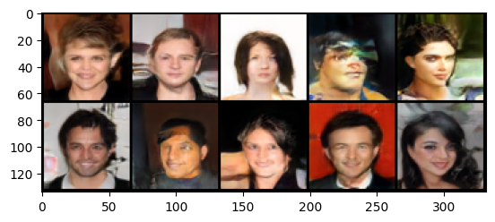

# Training StyleGAN on CelebA

In this project we developed the StylGAN according to the research paper, and trained it on the CelebA dataset. The project was developed using PyTorch. Due to the growing computation demands, the model training was abandoned when the StyleGAN grew to generate 64x64 images. 

The project was primarily developed on the Gradient platform by Paperspace, the A4000 GPU was used extensively for model training.

## Project Files

The model training is conducted within the training_styleGAN.ipynb file. This file makes use of various functions and classes from the other classes in the project.

In the `model_files` directory, the generator, and discriminator models at the end of 32x32 training are saved. These models can be used to get 32x32 images from the model.

## Model Training

The StyleGAN was trained on the CelebA dataset using the Wasserstein GAN with Gradient Penalty (WGAN-GP) loss function. The training followed the progressive nature of the ProGAN model where at each size, both the generator and discriminator are trained for a certain number of iterations before the size is increased.

During training the model's predictions were displayed alongside real images of the same size to get an idea of the model's progress in addition to the loss values which are a little less explanatory.

The PaperSpace Gradient platform was used for model training, this platform provides various GPU instances for 6 hours at a time. Since training the model beyond a certain size would take longer than 6 hours, the model was incrementally saved; this included the generator, discriminator, and the optimizer states. This allowed the model to be trained in parts and then continued from the last saved state.

However, at 64x64 the model was taking too long to train and the project was abandoned. The model was trained for 3 days using this stop-start method.

## Model Generation

Here is a sample of the images generated by the model at 64x64, during training.

